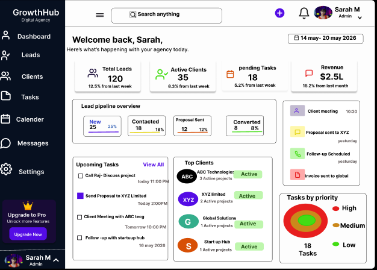
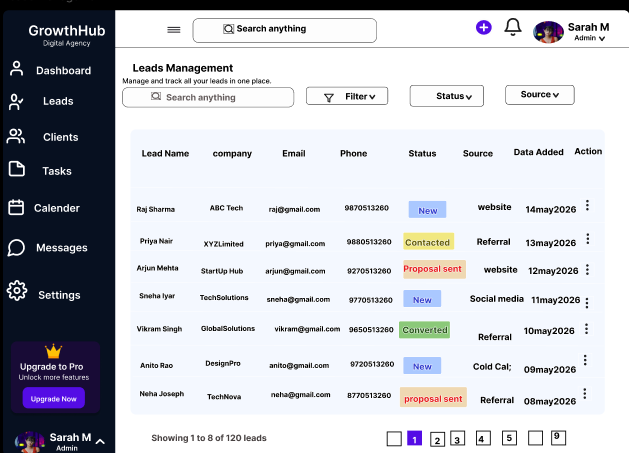
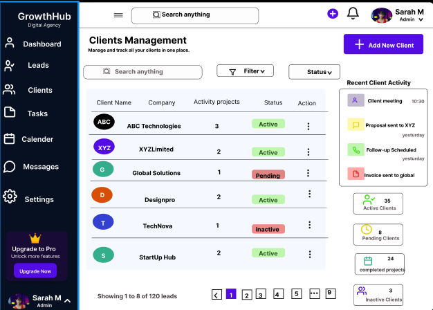
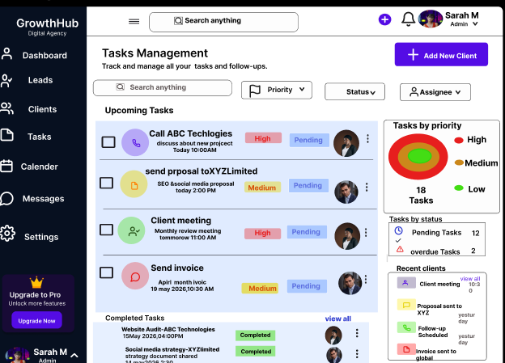
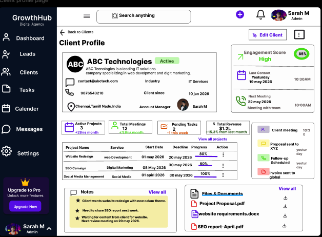

# FUTURE_UIUX_03

## Project Title

CRM / Client Management Dashboard UI/UX Design

## Description

This project is a modern and user-friendly CRM (Client Relationship Management) Dashboard designed as part of a UI/UX internship task. The dashboard helps agencies manage leads, clients, tasks, follow-ups, and business activities through a centralized and organized platform.

## Features

- Modern and professional dashboard design
- Lead tracking and management
- Client management system
- Task and follow-up tracking
- Client profile and engagement monitoring
- Clean and scalable SaaS interface
- User-friendly navigation

## Figma Design

[Figma Prototype](https://www.figma.com/proto/KWwzNJVTmG3pu0reGpsQ84/Dashboard?node-id=1-2&p=f&t=LwCXGaxeFTJu7Yfc-1&scaling=min-zoom&content-scaling=fixed&page-id=0%3A1)

## Tools Used

- Figma
- UI/UX Design Principles

## Deliverables

- Design PDF
- Dashboard Home Page
- Leads Management Page
- Clients Management Page
- Tasks Management Page
- Client Profile Page

## Screenshots

### Dashboard Home

### Leads Management

### Clients Management

### Tasks Management

### Client Profile

## Files Included

- crm-dashboard.pdf
- dashboard-home.png
- leads-management.png
- clients-management.png
- tasks-management.png
- client-profile.png

## Project Objective

The objective of this project is to provide a centralized CRM solution for agencies and businesses to efficiently manage leads, clients, tasks, and follow-ups. The design focuses on improving workflow organization, productivity, and user experience.

## User Flow

Dashboard → Leads Management → Clients Management → Tasks Management → Client Profile
